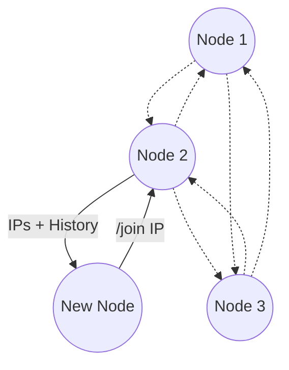

# smplchat

This project is a group work for master level course Distributed Systems at University of Helsinki. The main goal of this project is to design a large scale distributed system that has a global state, provides data consistency and synchronization, is fault tolerant and scalable. The implementation demonstrates these concepts of the designed system at small scale.



## Operation

### Just run the app

Application can be run directly from `src` directory like:
```
python3 -m smplchat
```

### Installation

Installation can be done with pip (or pipx):
```
pip install <project folder>
```

And then run app normally:
```
smplchat
```

## Developement Environment

### Installation

Developement environment with dependencies can be installed with poetry:
```
poetry install
```

### Running

Run the app inside developement environment via:
```
poetry run smplchat
```

### Testing

Pytest and other tools can be run like:
```
poetry run pytest
```

Developement related commands like pytest, coverage, pylint can also be run through `dev.sh` which is also used in the GitHub workflow.


### Operating multiple clients locally

You can test multiple clients on your own locally with Docker running.

In root, run this to build a Docker image of the app:
```
docker build -t smplchat .
```
This will build an image but not start any containers yet.

Then in however many terminals with this command we start a container and also start the app in it:
```
docker run -it --rm smplchat
```
All the containers get their own IP that you can use for the /join command. Use flag " -e DEBUG=1" before smplchat for debug mode.

You can run the build command again for any code changes, but if you want to remove the image, run:
```
docker rmi smplchat
```
