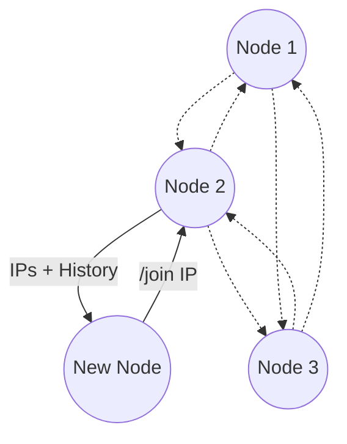

# smplchat

This project demonstrates that a fully distributed, fault-tolerant chat system can be built with a simple Gossip-style messaging algorithm and UDP networking.



## Operation

### Just run the app

Application can be run directly from `src` directory like:
```
python3 -m smplchat
```

### Installation

Installation can be done with pip (or pipx):
```
pip install <project folder>
```

And then run app normally:
```
smplchat
```

## Development Environment

### Installation

Development environment with dependencies can be installed with poetry:
```
poetry install
```

### Running

Run the app inside development environment via:
```
poetry run smplchat
```

### Testing

Pytest and other tools can be run like:
```
poetry run pytest
```

Development related commands like pytest, coverage, pylint can also be run through `dev.sh` which is also used in the GitHub workflow.


### Operating multiple clients locally

You can test multiple clients on your own locally with Docker running.

In root, run this to build a Docker image of the app:
```
docker build -t smplchat .
```
This will build an image but not start any containers yet.

Then in however many terminals with this command we start a container and also start the app in it:
```
docker run -it --rm smplchat
```
All the containers get their own IP that you can use for the /join command. Use flag " -e SMPLCHAT_DEBUG=1" before smplchat for debug mode.

You can run the build command again for any code changes, but if you want to remove the image, run:
```
docker rmi smplchat
```

### Tweaking settings
Settings can be modified in two places. Directly from `settings.py` file or by environment variables.

Environment variables have `SMPLCHAT_` prefix.

For example adjust settings so that gossipping relays message to 5 others and stops after it:
```
SMPLCHAT_GOSSIP_FANOUT=5 SMPLCHAT_RELAY_SEEN_LIMIT=1 smplchat
```
